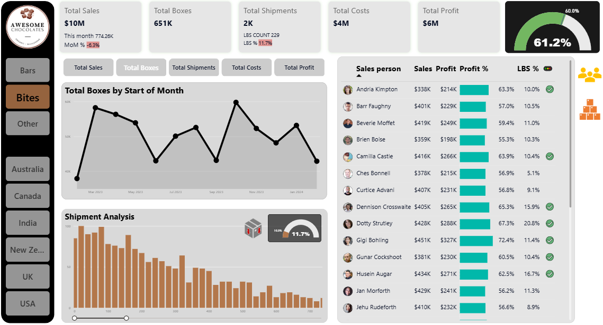

# Chocolate_factory
Interactive Power BI dashboard for analyzing chocolate sales performance across multiple countries and product categories. Features KPI tracking, sales trends, shipment analysis, profitability metrics, and salesperson performance rankings. Built using Power BI, Power Query, DAX, and data modeling techniques.

See full dashboard here - [App Power BI LINK](https://app.powerbi.com/groups/me/reports/3a283659-a5a6-41aa-b9f3-20aa4e926561/615f80fd207cd56c1393?ctid=a74ba355-27d7-42bb-a01d-80e2ade00411&pbi_source=shareVisual&visual=119094d1483b11db1016&height=194.00&width=1418.00&bookmarkGuid=5c32749f-bde2-441b-86cf-3a39e33a0992)

